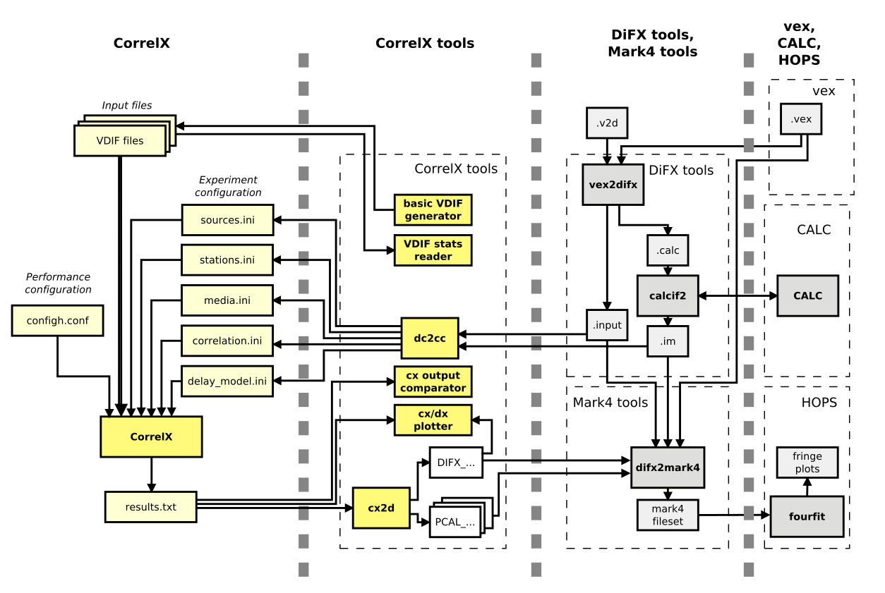
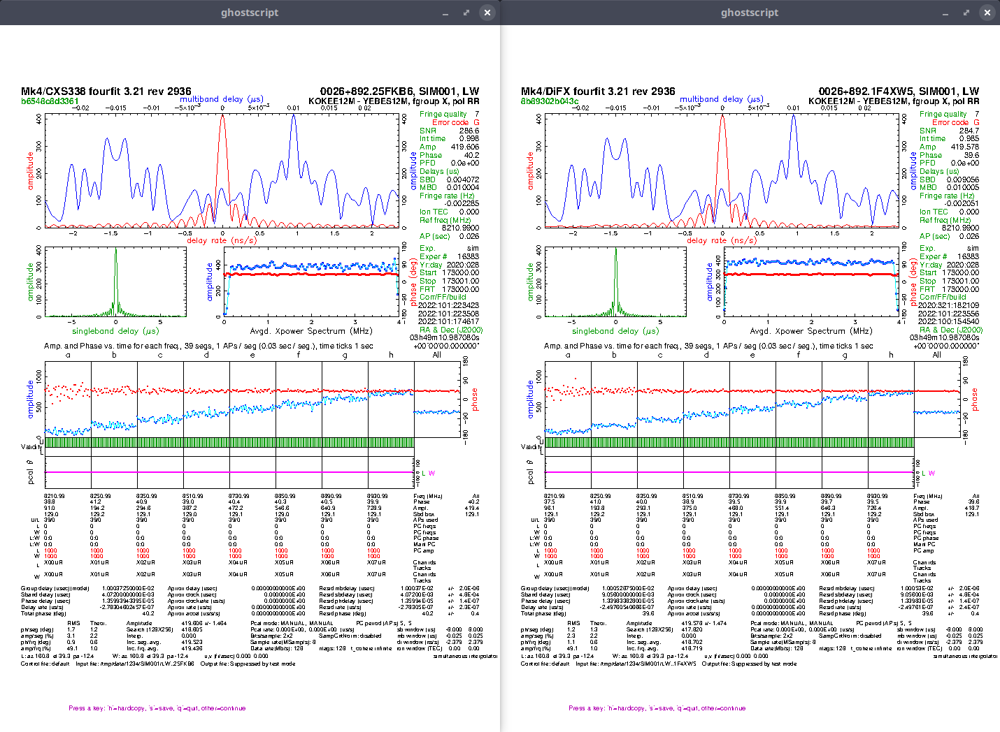

# VLBI Correlation Docker Tools

This repository contains some dockerized VLBI correlation tools:
* **Postprocessing**: MIT Haystack's [HOPS tools](https://www.haystack.mit.edu/haystack-observatory-postprocessing-system-hops/).
* **Configuration and conversion**: ATNF CSIRO's [DiFX tools](https://www.atnf.csiro.au/vlbi/dokuwiki/doku.php/difx/start).
* **Correlation**: [CXS338/CXPL38](https://github.com/ajvazquez/CXS338) correlator and tools (alpha, only for dev/testing).

The aim of this project is to provide lightweight images for quick and simple access to the tools displayed in the following diagram (Fig. 1 from the [CorrelX manual](https://github.com/MITHaystack/CorrelX/blob/master/correlx-user-developer-guide.pdf), page 8):
* CX: CXPL38 (pipeline) [cxp](cxp) and CXS338 (Spark) [cxs](cxs) - alpha, only dev/test.
* CX tools: CXPL ([cxp](cxp)) - alpha, only dev/test.
* DiFX tools: [vex2difx](vex2difx), [difxcalc](difxcalc), [difx2mark4](difx2mark4).
* HOPS: [hops](hops) (hops-cxs changes the correlator string for CXS).


(Fig. 1 from the [CorrelX manual](https://github.com/MITHaystack/CorrelX/blob/master/correlx-user-developer-guide.pdf), page 8)

For the most up-to-date/production versions or high performance deployments of these tools please refer to the [official repositories](#References) hosting these tools.

Once built, all the tools can be run for processing files on the host filesystem specifying the target folder.

## Tool Folder Structure

Every tool-associated folder provides the following files:
* ```build.sh```: Script for building the image.
* ```install.sh```: Script provided for convenience that builds the image and creates an alias in ```~/.bashrc``` starting with ```d-``` (e.g.: d-hops, d-cxs).
* ```run.sh```: Script for running a container, bypassing all parameters to the tool, and mounting the folder specified in the environment variable ```EXP``` in /tmp/data (if EXP is not defined the current path will be mounted).
  
The following scripts are only available for the HOPS image:
* ```run_x.sh```: Similar to run.sh, but using the host x-server (tested on Ubuntu host).

The following scripts are only available for the CXS/CXP images:
* ```run_dev.sh```: Similar to run.sh, but mounting a folder (specified in the script) with the sources from the host.
* ```run_jupyter.sh```: Launches a jupyterlab notebook, the main package being ```cxs``` (e.g.: from cxs.conversion.difx import cx2d_lib).

All ```run*.sh``` scripts can be run with the argument ```--docker-bash```, that allows to get into the docker container (intended for debugging).

## Images

Resulting images:
```
REPOSITORY     BASE          TAG                   SIZE
hops           [debian]      latest                145MB
hops-cxs       [debian]      latest                145MB
difxcalc       [debian]      latest                89.7MB
vex2difx       [debian]      latest                84.2MB
difx2mark4     [debian]      latest                63.4MB
cxp            [python]      latest                609MB
cxs            [spark]       latest                2.23GB
```

Base images:  
```
REPOSITORY                   TAG                   SIZE
debian                       stretch-slim          55.4MB
python                       3.8-slim-bullseye     124MB
bitnami/spark                latest                1.67GB
```

## Installation

1. Install Docker: https://docs.docker.com/
2. Build images and create aliases: run ```bash install_all.sh && source ~/.bashrc```.

Tools can also be installed or built individually:
* Install a single tool: run ```bash install.sh && source ~/.bashrc``` on the desired tool folder.
* Build a single tool: run ```bash build.sh``` on the desired tool folder.

The created aliases are as follows:
* d-hops CMD (e.g.: d-hops fourfit)
* d-hops-cxs CMD (e.g.: d-hops-cxs fourfit)
* d-difxcalc
* d-difx2mark4
* d-vex2dfix
* d-cxp CMD (e.g.: d-cxp cx-vdif-info)
* d-cxp-dev CMD (e.g.: d-cxp cx2d)
* d-cxp-jupyter
* d-cxs
* d-cxs-dev

Notes: 
* Scripts that accept CMD can be used with bash (e.g.: d-cxp-dev bash).
* All paths in input files must be relative or absolute to /tmp/data/ (in the container), as that is the path where the dataset volume is mounted.
An example CXS338 configuration file is provided in cxs/examples/cxs338.ini using this path (all .ini files are expected to be in the EXP folder).
* Spark UI for CXS338 is accessible via browser on localhost:4040.
* Jupyterlab for CXPL38 is accessible via browser on localhost:8888.


## Example

Build all images and create aliases:
```
bash install_all.sh && source ~/.bashrc
```

Prepare example dataset from [ViewRDS 7th example](https://github.com/TUW-VieVS/VieRDS/tree/main/EXAMPLES/zerobaseline_007_fourfit_Xband_increasing_source_flux) with this [setup](https://github.com/TUW-VieVS/VieRDS/blob/main/DIFX/easy_corr.sh):
```
git clone --depth 1 --filter=blob:none --sparse https://github.com/TUW-VieVS/VieRDS.git 
cd VieRDS
git sparse-checkout set EXAMPLES/zerobaseline_007_fourfit_Xband_increasing_source_flux
```

Take initial configuration and media:
```
mkdir test_proc
cp EXAMPLES/zerobaseline_007_fourfit_Xband_increasing_source_flux/*.{vdif,vex,v2d,filelist} test_proc
```

Prepare CXS configuration (d-vex2difx, d-difxcalc, d-cxp):
```
cd test_proc
d-vex2difx sim.v2d
d-difxcalc --all
d-cxp im2cx /tmp/data sim_1
mv *.vdif media/
```

Run CXS (d-cxs):
```
d-cxs -c /opt/cx/cxs338.ini
```

Convert output to Mk4 (d-cxp, d-difx2mark4):
```
OUT=`ls -td -- ./output/*/ | head -n1 | cut -d'/' -f3`
cp *.ini output/$OUT/
d-cxp cx2d output/$OUT/ OUT_s0_v0.out cx_ 1 -1 R R
mkdir sim_1.difx
cp output/$OUT/cx_DIFX_58876_63000.s0000.b0000 sim_1.difx/DIFX_58876_63000.s0000.b0000
rm -rf 1234
d-difx2mark4 -b X 1000 20000 sim_1
```

Run fourfit (d-hops-cxs):
```
d-hops-cxs fourfit -tx -bLW -m1 1234/SIM001 set pc_mode manual dr_win -100 100 sb_win -100000 100000 mb_win -100 100
```

Run fourfit on reference data (d-hops):
```
cd ../EXAMPLES/zerobaseline_007_fourfit_Xband_increasing_source_flux/
d-hops fourfit -tx -bLW -m1 1234/SIM001 set pc_mode manual dr_win -100 100 sb_win -100000 100000 mb_win -100 100
```


## Disclaimer

CXS338, CXPL38, and this repository are prototypes (alpha), only intended for development/testing.
For the most up-to-date/production versions or high performance deployments please refer to the [official repositories](#References) hosting these tools.

## References

* HOPS: https://www.haystack.mit.edu/haystack-observatory-postprocessing-system-hops/
* DiFX tools: https://www.atnf.csiro.au/vlbi/dokuwiki/doku.php/difx/start
* CorrelX (alpha): https://github.com/MITHaystack/CorrelX
* CXS338 (alpha): https://github.com/ajvazquez/CXS338
* VieRDS: https://github.com/TUW-VieVS/VieRDS
 
